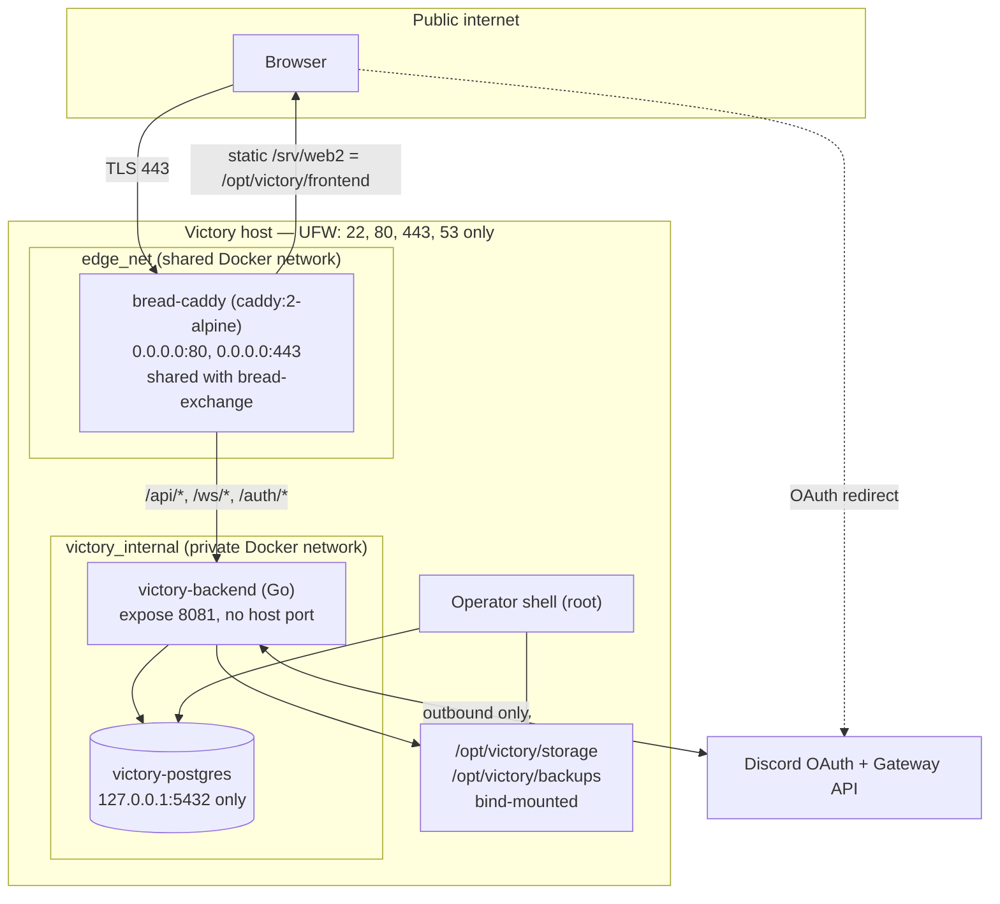

# Kernel 76 — Architecture and Exposure Map

Deployment as it actually runs, verified 2026-07-30/31 from `docker ps`, `ss -ltnp`,
`ufw status`, `docker inspect`, and the live Caddyfile — not from documentation.

---

## 1. Diagram

---

## 2. Trust boundaries

| # | Boundary | What crosses | Enforcement | Status |
|---|---|---|---|---|
| B1 | Internet → Caddy | TLS termination, HTTP | UFW allows 22/80/443/53. Ports 5432, 8081, 18081 are **not** exposed. | sound |
| B2 | Caddy → backend | `/api/*`, `/ws/*`, `/auth/*` | Only these three prefixes are proxied. Everything else is static file service. `/health` is therefore not publicly reachable (K76-I03). | sound |
| B3 | Anonymous → authenticated | `victory_session` cookie | Server-side session, SHA-256-hashed token, `HttpOnly`+`Secure`+`SameSite=Lax`, 24h TTL, revocable. | sound |
| B4 | Authenticated → admitted | venue/Production/Show membership | `access.UserCanAccessVenueSlug`, `participation` resolver, per-resource ownership. | **two holes found and repaired** — K76-H02, K76-M01 |
| B5 | Member → staff | Producer/Director role | `resolveInviteAuthorityScope` + explicit role checks. | sound after K76-M01 |
| B6 | Application → operator | `OPERATOR_HANDLE` handle match | `access.IsOperatorUser`. No database flag — authority is the handle, which makes it visible and auditable. | sound |
| B7 | Backend → PostgreSQL | `DATABASE_URL` | Loopback-bound; credential now from `.env` (0600, gitignored). | sound after K76-H03 |
| B8 | Backend → filesystem | uploads under `/opt/victory/storage` | Paths built from server-generated UUIDs, never client filenames; content re-encoded. | sound |
| B9 | Backend ↔ Discord | OAuth code exchange, bot gateway | Outbound only; client secret and bot token from `.env`. State is hashed, single-use, expiring. | sound |
| B10 | Operator shell → everything | root | Outside the application permission model by design (§1.5). | accepted |

**B4 is where the audit paid for itself.** Every finding that exposed real user data lived at
the authenticated-versus-admitted boundary: code that asked "are you signed in?" where it
should have asked "are you in this room?"

---

## 3. Runtime mode (§4.4)

The environment was running **two backends against one live database**:

| Process | Port | Source | Serving traffic? |
|---|---|---|---|
| `victory-backend` container | `8081` via `edge_net` | last `docker compose build` | **yes** — Caddy proxies `backend:8081` |
| host `go run ./cmd/victory` | `0.0.0.0:18081` | working tree as of 2026-07-28 | no, but writing to the same database |

The host process was a stale development instance from three days earlier. It was stopped
during Kernel 76 (K76-L02) — it also blocked the database rebuild by holding a connection.

**Canonical mode: full Docker Install Mode.** Dev Mode remains available per
`Construction/Process/workflow/dev-workflow.md`; the operative rule is that only one backend should
point at the live database at a time.

---

## 4. Data at rest

| Store | Location | Exposure |
|---|---|---|
| PostgreSQL | Docker volume `victory_postgres_data` | loopback only; no remote listener |
| Uploads | `/opt/victory/storage` (bind mount) | served only through `/api/assets/{id}/content` |
| Backups | `/opt/victory/backups` | **on the same host** — see the backup assessment |
| Secrets | `/opt/victory/.env` | `0600`, gitignored |
| Frontend | `/opt/victory/frontend` → `/srv/web2` | fully public by design |

Anything placed in `/opt/victory/frontend` is world-readable over HTTPS with no
authentication. That is the intended behaviour for the SPA, and it is worth restating because
it makes the directory a poor place for anything else.

---

## 5. Third-party dependencies

| Component | Version/source | Note |
|---|---|---|
| PostgreSQL | `postgres:16-alpine` | mutable tag — pin digest (K77-06) |
| Caddy | `caddy:2-alpine` | shared with bread-exchange; not Victory-controlled |
| Go modules | `pgx/v5`, `gorilla/websocket`, `golang.org/x/crypto` | small, current, actively maintained |
| Discord | OAuth2 + Gateway v10 | outbound only |

Victory has a notably small dependency surface: no ORM, no web framework, no frontend build
chain. Most of the attack surface is first-party code, which is why a code-read audit was
tractable at all.
